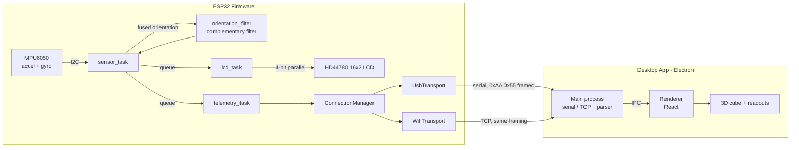

# Project
An ESP32-based IMU orientation tracker with a companion desktop app. The device reads a 6-axis IMU, fuses accelerometer and gyroscope data into a live roll/pitch estimate, shows it on an onboard LCD, and streams it to a desktop app over USB or Wi-Fi, where it drives a real-time 3D visualization.

Built from the datasheet and register level up — no display or IMU libraries, no framework abstractions hiding the protocol work.


<p align="center">
  
</p>


## What it does

- Reads a 6-axis MPU6050 IMU over I2C (accelerometer + gyroscope, burst-read in one transaction)
- Fuses accel + gyro into a stable roll/pitch estimate with a hand-rolled complementary filter
- Displays live orientation on a 16x2 character LCD, driven entirely by a custom 4-bit-mode driver
- Streams orientation telemetry to a desktop app over USB serial or Wi-Fi (auto-provisioned via ESPTouch V2 — no captive portal, no manual AP config)
- Desktop app renders a live-rotating 3D cube plus numeric readouts, and lets you provision a fresh device onto Wi-Fi from the UI

## Why roll/pitch and not yaw

Yaw would require integrating the gyro's Z-axis rate over time with nothing to correct it against — an IMU alone has no absolute heading reference (that needs a magnetometer). Left uncorrected, that integration drifts without bound, so displaying it would just show a slowly (or not so slowly) lying number. Roll and pitch don't have this problem: gravity is always available as a correction reference, so a complementary filter can continuously pull the gyro's short-term response back toward the accelerometer's long-term truth. Rather than ship a number that looks like data but isn't trustworthy, yaw is left out.

## Design



Two independent FreeRTOS queues carry orientation data out of `sensor_task` — one to the LCD, one to telemetry — because a single shared queue would split items between the two consumers instead of delivering every reading to both (a queue only ever hands one item to one receiver). `sensor_task` never blocks on what either consumer does with the data; it reads the IMU on a fixed cadence and fans out with a cheap, non-blocking send.

## Hardware

| Component | Interface | Notes |
|---|---|---|
| ESP32 dev board | — | Espressif ESP32-WROOM class module |
| HD44780 16x2 character LCD | 4-bit parallel (RS, EN, DB4–DB7) | R/W hardwired to GND — the Busy Flag can never be polled, so every instruction's timing is guarded with a datasheet-derived worst-case delay instead |
| MPU6050 6-axis IMU | I2C | Accelerometer ±2g, gyroscope ±250°/s, onboard DLPF enabled for noise reduction |

## Firmware (`src/`)

| Path | Responsibility |
|---|---|
| `display_driver/hd44780.c` | HD44780 driver from scratch: GPIO bring-up, the 4-bit resync/init sequence from the datasheet's initialization flowchart, nibble-splitting byte writes, DDRAM cursor addressing across both rows, and per-instruction timing guards for the two long-latency commands (Clear Display, Return Home) |
| `sensors/motion_sensor.c` | MPU6050 bring-up and register-level I2C reads (`i2c_master` API) |
| `sensors/orientation/orientation_filter.c` | Complementary filter fusing accel-derived tilt angles with gyro rate integration |
| `tasks/sensor_task` | Owns the IMU read loop; fans fused orientation out to every consumer queue |
| `tasks/lcd_task` | Consumes orientation, renders it to the LCD |
| `tasks/telemetry_task` | Consumes orientation, packs it into the wire protocol, hands it to whichever transport is active |
| `transport/` | `ITransport` interface with `UsbTransport` and `WifiTransport` implementations, arbitrated by `ConnectionManager`; a custom heartbeat protocol detects a live USB link without relying on OS-level serial "connected" state |
| `transport/wifi_transport/wifi_touch_handler` | ESPTouch V2 SmartConfig — the phone/desktop broadcasts Wi-Fi credentials over the air (AES-encrypted) and the device picks them up without ever needing a captive portal or hardcoded SSID |

## Wire protocol

Every packet — heartbeat or telemetry — starts with the same two-byte magic (`0xAA 0x55`) followed by a device-family byte (`0x4B`, `'K'` for Kestrel), so the desktop app can resync mid-stream if bytes are ever lost or a connection reattaches mid-frame.

**Telemetry packet — 7 bytes:**

| Offset | Bytes | Field |
|---|---|---|
| 0–2 | 3 | Magic: `0xAA 0x55 0x4B` |
| 3–4 | 2 | Roll, `int16` big-endian, degrees × 100 |
| 5–6 | 2 | Pitch, `int16` big-endian, degrees × 100 |

Fixed-point (degrees × 100) instead of raw `float` keeps the packet small and reuses the same big-endian integer encoding as the rest of the protocol, at the cost of quantizing to 0.01° — well below what the sensor itself resolves.

## Desktop app (`desktop-app/`)

Electron + React + TypeScript. The main process owns the serial/TCP connection and a small stateful parser (`TelemetryParser`) that reassembles the magic-framed packets from a raw byte stream; parsed readings cross into the renderer over IPC, where they drive a live-rotating CSS 3D cube and numeric Roll/Pitch readouts, smoothed with an exponential lerp and a noise deadband tuned for degree-scale input.

## Building

**Firmware** (PlatformIO):
```bash
pio run                                  # build
pio run --target upload --upload-port /dev/cu.usbserial-XXXX
```

**Desktop app:**
```bash
cd desktop-app
npm install
npm run dev      # development
npm run build    # typecheck + production build
```

## Notes worth knowing about

A few things that came up building this that felt worth writing down, since they weren't obvious going in:

- **The Busy Flag trap.** With R/W hardwired low, the controller can never be asked "are you still busy?" — every instruction's delay has to be a conservative, datasheet-derived worst case instead. Clear Display and Return Home are ~40x slower than every other instruction, which the driver handles by routing every command through one shared byte-sending path and layering the extra wait on top as pure time, rather than duplicating the send logic.
- **A real protocol bug, not a typo.** An earlier version of the "long-delay" command path called the pulse-strobe function one extra time per nibble, desyncing the HD44780's high/low nibble pairing — Clear Display never actually reached the display as `0x01`, so DDRAM was never cleared and stale content (uninitialized internal RAM) showed through as solid block characters. Traced by hand-counting EN pulses against the known-good path, not by guessing.
- **FreeRTOS queues deliver to one receiver, not all of them.** Fanning the same sensor reading out to two independent consumers (LCD + telemetry) needs two separate queues, one per consumer — sharing a single queue between two readers means each item goes to whichever task happens to receive it first, silently dropping data for the other.
